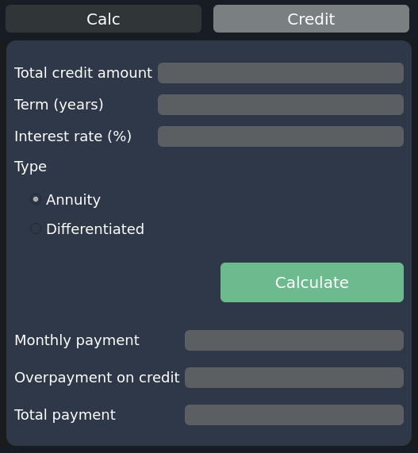

# SmartCalc v1.0 (Individual project)

## Score:
The final score is 115% (max for base and bonus part 1, bonus part 2 wasn't implemented).

The calc was developed with frontend on QT 5.15.3 (C++) and backend on C.

## Task

Implementation of an extended version of the usual calculator in the C programming language using structured programming. In addition to basic arithmetic operations such as add/subtract and multiply/divide, the calculator must have the ability to calculate arithmetic expressions by following the order, as well as some mathematical functions (sine, cosine, logarithm, etc.).

Besides calculating expressions, it should also support the use of the _x_ variable and the graphing of the corresponding function.

As for other improvements you can consider a credit and deposit calculator.

## Requirements

- The program must be built with Makefile which contains standard set of targets for GNU-programs: all, install, uninstall, clean, dvi, dist, test, gcov_report. Installation directory could be arbitrary, except the building one.
- Both integers and real numbers with a dot can be input into the program.
- The calculation must be done after you complete entering the calculating expression and press the `=` symbol.
- Calculating arbitrary bracketed arithmetic expressions in infix notation
- Calculate arbitrary bracketed arithmetic expressions in infix notation with substitution of the value of the variable _x_ as a number
- Plotting a graph of a function given by an expression in infix notation with the variable _x_ (with coordinate axes, mark of the used scale and an adaptive grid)
    - It is not necessary to provide the user with the ability to change the scale
- Domain and codomain of a function are limited to at least numbers from -1000000 to 1000000
    - To plot a graph of a function it is necessary to additionally specify the displayed domain and codomain
- Verifiable accuracy of the fractional part is at least to 7 decimal places
- Users must be able to enter up to 255 characters
- Bracketed arithmetic expressions in infix notation must support the following arithmetic operations and mathematical functions:
    - **Arithmetic operators**:

      | Operator name  | Infix notation   (Classic) | Prefix notation   (Polish notation) | Postfix notation   (Reverse Polish notation) |
      | -------------- | ------------------------------- | ---------------------------------------- | ------------------------------------------------- |
      | Brackets       | (a + b)                         | (+ a b)                                  | a b +                                             |
      | Addition       | a + b                           | + a b                                    | a b +                                             |
      | Subtraction    | a - b                           | - a b                                    | a b -                                             |
      | Multiplication | a * b                           | * a b                                    | a b *                                             |
      | Division       | a / b                           | / a b                                    | a b \                                             |
      | Power          | a ^ b                           | ^ a b                                    | a b ^                                             |
      | Modulus        | a mod b                         | mod a b                                  | a b mod                                           |
      | Unary plus     | +a                              | +a                                       | a+                                                |
      | Unary minus    | -a                              | -a                                       | a-                                                |

      >Note that the multiplication operator contains the obligatory sign `*`. Processing an expression with the omitted `*` sign is optional and is left to the developer's decision

    - **Functions**:
  
      | Function description       | Function |
      | -------------------------- | -------- |
      | Computes cosine            | cos(x)   |
      | Computes sine              | sin(x)   |
      | Computes tangent           | tan(x)   |
      | Computes arc cosine        | acos(x)  |
      | Computes arc sine          | asin(x)  |
      | Computes arc tangent       | atan(x)  |
      | Computes square root       | sqrt(x)  |
      | Computes natural logarithm | ln(x)    |
      | Computes common logarithm  | log(x)   |

## Part 2. Bonus. Credit calculator

Provide a special mode "credit calculator" (you can take banki.ru and calcus.ru as an example):
- Input: total credit amount, term, interest rate, type (annuity, differentiated)
- Output: monthly payment, overpayment on credit, total payment

## Part 3. Bonus. Deposit calculator

Provide a special mode "deposit profitability calculator" (you can take banki.ru and calcus.ru as an example):
- Input: deposit amount, deposit term, interest rate, tax rate, periodicity of payments, capitalization of interest, replenishments list, partial withdrawals list
- Output: accrued interest, tax amount, deposit amount by the end of the term
